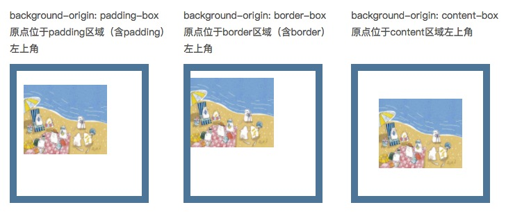
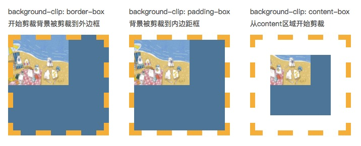

# CSS 属性

## 黑白配色

-   若 filter 属性的值不是 none，会给「绝对和固定定位的后代」创建一个 containing block，除非它适用的元素是当前浏览上下文中的文档根元素（即<html>）。
-   `filter: grayscale(1)`
-   兼容处理
    ```css
    .gray {
        -webkit-filter: grayscale(100%);
        -moz-filter: grayscale(100%);
        -ms-filter: grayscale(100%);
        -o-filter: grayscale(100%);
        filter: grayscale(100%);
        -webkit-filter: gray;
        filter: gray;
        -webkit-filter: progid:dximagetransform.microsoft.basicimage(grayscale=1);
        filter: progid:dximagetransform.microsoft.basicimage(grayscale=1);
    }
    ```
-   部分变灰（保留不变灰元素）
    -   `backdrop-filter`是让当前元素所在区域`后面`的内容模糊灰度或高亮之类,可以通过 z-index 属性实现 z-index 高于 html 的元素不灰
    ```css
    html::before {
        content: '';
        position: fixed; // 设置为absolute可实现首屏灰
        backdrop-filter: grayscale(100%);
        pointer-events: none;
        inset: 0;
        z-index: 100;
    }
    .not-gray {
        //不置灰的元素
        position: relative;
        z-index: 1000;
    }
    ```
    -   使用 js 递归设置属性

## 平滑滚动到指定元素

```js
document.getElementById('payment-title').scrollIntoView(alignToTop, {
    // alignToTop 为true 与元素顶部对齐，false为底部对齐
    behavior: 'smooth',
})
```

## background 属性

-   `background-color` 背景颜色
-   `background-img` 背景图片
-   `background-repeat` 背景重复
    -   repeat，表示一直重复平铺图片；
    -   no-repeat，表示不重复图片；
    -   repeat-x，表示水平方向重复平铺图片；
    -   epeat-y，表示垂直方向重复平铺图片；
    -   inherit，表示从父元素继承 repeat 值；
-   `background-size` 背景大小（IE8 以下不支持该属性；）
    -   auto 默认值
    -   长度 百分比
    -   cover 较短的边等于容器的边时, 停止缩放
    -   contain 较长的边等于容器的边时, 停止缩放
-   `background-positon` 位置
    -   top|right|bottom|left 两个值
    -   百分比 两个值
    -   px 两个值
-   `background-origin` 相对位置
    -   border-box，边框盒。
    -   padding-box，内边距框。默认值
    -   content-box，内容框。
        
-   `background-clip` 背景绘制的区域

    -   border-box，背景被裁剪到边框盒。
    -   padding-box，背景被裁剪到内边距框。
    -   content-box，背景被裁剪到内容框。
        

-   `background-attachment` 背景是否固定滚动
    -   fixed|scroll|inherit 可选值
