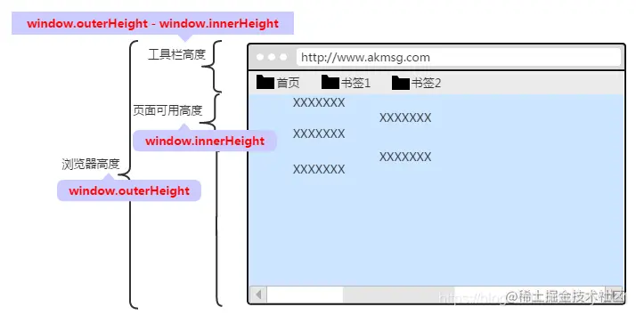
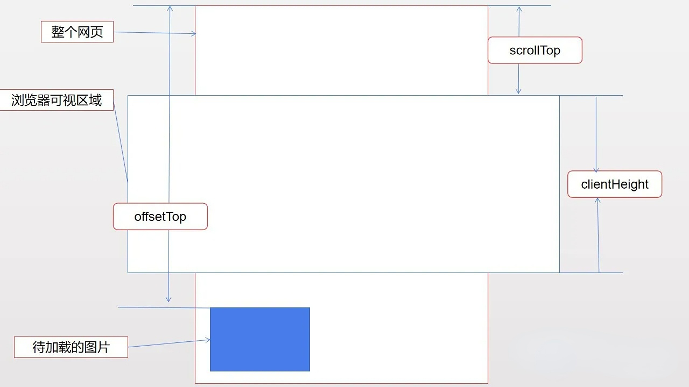

# IntersectionObserver

## API

```js
var io = new IntersectionObserver(callback, option);

// 开始观察
io.observe(document.getElementById("example"));

// 停止观察
io.unobserve(element);

// 关闭观察器
io.disconnect();
```

- callback 可见性变化时的回调函数

  ```js
    var io = new IntersectionObserver(
      entries => {
        console.log(entries); // entries 是一个数组，每项都表示被监听的对象
      }
    );
    // entrie
    {
      time: 3893.92,
      rootBounds: ClientRect {
        bottom: 920,
        height: 1024,
        left: 0,
        right: 1024,
        top: 0,
        width: 920
      },
      boundingClientRect: ClientRect {
         // ...
      },
      intersectionRect: ClientRect {
        // ...
      },
      intersectionRatio: 0.54,
      target: element
    }
  ```

  - time：可见性发生变化的时间，是一个高精度时间戳，单位为毫秒
  - target：被观察的目标元素，是一个 DOM 节点对象
  - rootBounds：根元素的矩形区域的信息，getBoundingClientRect()方法的返回值，如果没有根元素（即直接相对于视口滚动），则返回 null
  - boundingClientRect：目标元素的矩形区域的信息
  - intersectionRect：目标元素与视口（或根元素）的交叉区域的信息
  - intersectionRatio：目标元素的可见比例，即 intersectionRect 占 boundingClientRect 的比例，完全可见时为 1，完全不可见时小于等于 0

- option 是配置对象（该参数可选)
  - `threshold`属性决定了什么时候触发回调函数。它是一个数组，每个成员都是一个门槛值，默认为[0]，即交叉比例（intersectionRatio）达到 0 时触发回调函数。
  - `root`指定目标元素所在的容器节点（即根元素）, `rootMargin`定义根元素的 margin，用来扩展或缩小 rootBounds 这个矩形的大小，从而影响 intersectionRect 交叉区域的大小
- 构造函数的返回值是一个观察器实例
- 实例的 observe 方法可以指定观察哪个 DOM 节点,如果要观察多个节点，就要多次调用这个方法。

## 兼容插件

- [intersection-observer](https://www.npmjs.com/package/intersection-observer)
- [intersection-observer-polyfill](https://www.npmjs.com/package/intersection-observer-polyfill)

## 使用示例

- 懒加载

```js
import IntersectionObserver from "intersection-observer-polyfill";
import "intersection-observer";

let __io__ = null;

const intersectionHandler = function (entries) {
  for (const entry of entries) {
    if (
      // 正在交叉
      entry.isIntersecting
    ) {
      const listeners = entry.target.__intersectionListener__ || [];
      if (listeners.length) {
        listeners.forEach((fn) => {
          fn();
          __io__.unobserve(entry.target);
          entry.target.__isNew__ = false;
        });
      }
    }
  }
};

export const addIntersectionListener = function (element, fn, catchFn) {
  try {
    if (!element.__intersectionListener__) {
      element.__intersectionListener__ = [];
      // dom加载后加载文件 new IntersectionObserver实例
      if (!__io__) {
        __io__ = new IntersectionObserver(intersectionHandler, {
          rootMargin: "0px 0px",
          root: null,
          threshold: [0],
        });
      }
      if (!element.__isNew__) {
        __io__.observe(element);
        element.__isNew__ = true;
      }
    }
    element.__intersectionListener__.push(fn);
  } catch (error) {
    catchFn();
  }
};

export const refreshIntersectionListener = function (element, catchFn) {
  try {
    if (!element.__isNew__) {
      __io__.observe(element);
    }
  } catch (error) {
    catchFn();
  }
};

export const removeIntersectionListener = function (element) {
  if (
    !element ||
    !element.__intersectionListener__ ||
    element.__isNew__ === undefined
  )
    return;
  element.__intersectionListener__ = null;
  element.__isNew__ = null;
  disconnectIntersectionListener();
};

export const disconnectIntersectionListener = function () {
  if (__io__ && __io__.disconnect) {
    __io__.disconnect();
    __io__ = null;
  }
};
```

# 浏览器视口 API

### 设备（显示器）

- `window.screen.height` 获取获屏幕取理想视窗高度，这个数值是固定的，设备的分辨率/设备像素比
- `window.screen.availHeight` 屏幕的可用高度，一般是显示屏高度减去显示屏任务栏的高度

## 浏览器窗口



- `window.outerHeight` 浏览器的高度，高度改变，会改变值的大小
- `window.innerHeight` 浏览器的可用高度 = 浏览器高度 - 顶部工具栏 ,若有调试面板还会再减去调度面板的高度，最后得出的才是可用高度

## body

- `document.body.clientHeight` body 的高度

## 网页

- `document.body.scrollHeight` 网页可见高度加上未显示的网页的高度（滚动条未显示部分）,与`document.body.clientHeight`结果基本一致

## 滚动条

- `document.body.scrollTop || document.documentElement.scrollTop` 获取滚动条到顶部的距离
- `document.body.scrollLeft || document.documentElement.scrollLeft` 获取滚动条到左边的距离

## 元素相对于视窗

- `element.getBoundingClientRect().top || element.offsetTop`



# 浏览器解析二维码、条形码的 Barcode Detection API。

## BarcodeDetector

```
if ('BarcodeDetector' in window) {
  // 创建检测器
  const barcodeDetector = new BarcodeDetector({
    // formats 是检测的条码格式类型
    formats: ['qr_code'] //qr_code表示二维条形码
  });
}
```

- 支持检测的条码类型：

```
BarcodeDetector.getSupportedFormats().then((supportedFormats) => {
  supportedFormats.forEach((format) => console.log(format));
});
```

- 解析(eleImg 不仅可以是  元素，SVGImageElement、HTMLVideoElement、HTMLCanvasElement、ImageBitmap、OffscreenCanvas、VideoFrame、Blob 图形或 ImageData 数据都是可以的)

```
barcodeDetector.detect(eleImg).then((barcodes) => {
    barcodes.forEach((barcode) => {
        console.log('解析结果是：' + barcode.rawValue);
    });
}).catch((err) => {
    console.error(`解析出错：${err}`);
});

```
