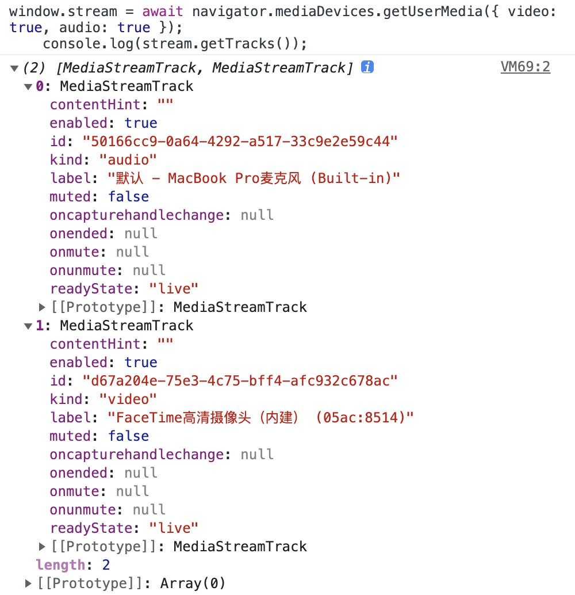
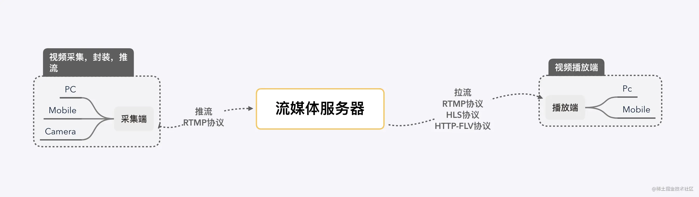

# <center>WebRTC</center>

## 媒体流

#### 1. [navigator.mediaDevices.getUserMedia(constraints)](https://developer.mozilla.org/zh-CN/docs/Web/API/MediaDevices/getUserMedia)

- 通过这个 API 可以获取媒体流权限，方法的参数是一个配置对象，可以配置媒体流类型以及分辨率等信息。可以通过`navigator.mediaDevices.getSupportedConstraints()` 获取 `constraints` 参数中具体支持的配置项
- 浏览器要获取摄像头权限需要开启本地端口或者 https 服务

```js
// 可配置 audio video为true 获取麦克风和摄像头的权限
// 默认constraints参数
let constraints = {
  audio: true,
  video: true,
};
// 获取本地音视频流
async function getLocalStream(constraints: MediaStreamConstraints) {
  // 获取媒体流
  const stream = await navigator.mediaDevices.getUserMedia(constraints);
  return stream;
}
// video 中也可以设置设备 id、前后置摄像头以及获取视频的宽高
navigator.mediaDevices.getUserMedia({
  audio: false,
  video: {
    width: 1280,
    height: 720,
  },
});
```

- stream(管理 tarck 的集合)

  1. stream 上有 2 个重要的属性
     - active 代表该流是否为活动状态
     - id 代表流的唯一值
  2. 在 stream 上有操作 track 的一些增删查方法：

     - addTrack: 将 track 添加到 stream 中
     - getTracks getVideoTracks getAudioTracks：会返回 track list
     - getTrackById: track 是有 id 属性，可以根据 id 在 stream 中获取该 track，如果不存在会返回 null
     - removeTrack: 传入值是 MediaStreamTrack 对象，而非 trackId

  3. 订阅 track 相关的事件：
     - onaddtrack
     - onremovetrack

- track(视频/音频轨道)
  
  1. 属性(除了 enabled 外，全是只读)：
     - id： 代表唯一值
     - kind: "audio" | "video"
     - enabled: 表示该轨道是否可用，可以被手动设置，设置为 false 后，视频黑屏，音频静音
     - label: 和 mediaDevices.enumerateDevices 返回值设备的 label 相对应
     - muted: 是否静音
     - readyState: 枚举值， "live"表示输入设备正常连接，"ended"表示没有更多的数据
  2. 方法
     - getConstraints(): 返回创建该轨道的配置,即当前 track 对应的`constraints`值
     - applyConstraints(): 给该轨道应用新的配置
     - getSettings(): 会返回包含浏览器默认添加的在内的所有配置，也就是轨道的所有配置
     - getCapabilities(): 方法返回一个 MediaTrackCapabilities 对象，此对象表示每个可调节属性的值或者范围，该特性依赖于平台和 user agent。eg:视频宽高的 min 和 max
     - clone(): 克隆一个 track 的备份，和 stream 一样，会产出一个新的 id
     - stop(): stop 后，readyState 的状态就变成了 ended

#### 2.[结合 video 和 canvas 可实现的拍照功能](./take-photo.html)

通过获取已经在播放媒体流的 video 标签，然后将其绘制到 canvas 上，再通过 `toDataURL` 方法将 canvas 转换为 base64 图片。

#### 3.navigator.mediaDevices.enumerateDevices

- 通过这个 API 可以获取到设备列表(移动设备的后置摄像等)，并且可以通过`deviceId`来切换设备,`kind`字段表示设备类型，eg:`videoinput`表示视频输入设备
-

```js
// 获取所有视频输入设备
async function getDevices() {
  const devices = await navigator.mediaDevices.enumerateDevices()
  console.log('devices', devices)
  let videoDevices = devices.filter((device) => device.kind === 'videoinput')
}
// 切换设备
function handleDeviceChange(deviceId: string) {
  const stream = await navigator.mediaDevices.getUserMedia({
    audio: false,
    video: {
      deviceId: { exact: deviceId },
    },
  })
}
// 切换前后摄像头
// 通过指定 facingMode 来实现，facingMode 有 4 个值，分别是 user(前)、environment(后) 和 left、right
function switchCamera() {
  let constraints = {
    video: true, // 开启默认摄像头
    audio: true,
  }
  constraints.video = {
    // 强制切换前后摄像头时，当摄像头不支持时，会报一个OverconstrainedError［无法满足要求的错误］
    // facingMode: { exact: 'environment' },
    // 也可以这样当前后摄像头不支持切换时，会继续使用当前摄像头，好处是不会报错
    facingMode:  'environment',
  }
}
```

#### 4.[navigator.mediaDevices.getDisplayMedia(constraints)](https://developer.mozilla.org/zh-CN/docs/Web/API/MediaDevices/getDisplayMedia)

使用方法与`getUserMedia`类似，可以获取屏幕的媒体流(屏幕共享)

```js
// 获取屏幕共享的媒体流
async function shareScreen() {
  let localStream = await navigator.mediaDevices.getDisplayMedia({
    audio: true,
    video: true,
  });
  // 播放本地视频流
  playStream(localStream);
}

// 在视频标签中播放视频流
function playStream(stream: MediaStream) {
  const video = document.querySelector("#localVideo");
  video.srcObject = stream;
}
```

#### 5.[MediaRecorder](https://developer.mozilla.org/zh-CN/docs/Web/API/MediaRecorder)

`MediaRecorder`是录制媒体流的 API
但是 `MediaRecorder` 对 mimeType 参数的支持是有限的。所以我们需要通过 `MediaRecorder.isTypeSupported` 来判断当前浏览器是否支持我们需要的 mimeType。

- chrome 中 MediaRecorder 支持的 mimeType 如下：
  ```js
  "video/webm";
  "video/webm;codecs=vp8";
  "video/webm;codecs=vp9";
  "video/webm;codecs=h264";
  "video/x-matroska;codecs=avc1";
  ```
- 常用的视频编码 `['vp9', 'vp9.0', 'vp8', 'vp8.0', 'avc1', 'av1', 'h265', 'h264']`
- 常用的视频格式 `['webm','mp4','ogg','mov','avi','wmv','flv','mkv','ts','x-matroska']`
- 浏览器video标签支持的格式，容器封装格式有：MP4、WebM和Ogg
  - MP4 ： 使用h.264编码的视频和aac编码的音频
  - WebM ：使用 VP8 视频编解码器和 Vorbis 音频编解码器
  - Ogg：使用 Theora 视频编解码器和 Vorbis音频编解码器


```js
const options = {
  audioBitsPerSecond: 128000,
  videoBitsPerSecond: 2500000, //返回视频采用的编码比率
  mimeType: 'video/webm; codecs="vp8,opus"',
};
const mediaRecorder = new MediaRecorder(localStream, options);
// 录制开始
mediaRecorder.start();

mediaRecorder.ondataavailable = (e) => {
  // 收集录制的媒体流
};
// 停止录制 同时触发dataavailable事件
mediaRecorder.onstop = (e: Event) => {
  // 生成blob后可供下载（URL.createObjectURL + a标签） 或者 使用 ffmpeg 处理视频
  const blob = new Blob([e.data], { type: "video/mp4" });
};
```


## WebRTC

- [WebRTC](https://developer.mozilla.org/en-US/docs/Web/API/WebRTC_API) (Web Real-Time Communications) 是一项实时通讯技术，它允许网络应用或者站点，在不借助中间媒介的情况下，建立浏览器之间点对点（Peer-to-Peer）的连接
- WebRTC 可以实现视频流和（或）音频流或者其他任意数据的传输。
- WebRTC 包含的这些标准可以使用户在无需安装任何插件或者第三方的软件的情况下，创建点对点（Peer-to-Peer）的数据分享和电话会议。
- WebRTC 只能在 HTTPS 协议或者 localhost 下使用，如果是 HTTP 协议，会报错。
- 引入 adpater.js 来适配各浏览器

### 优势

- 跨平台(Web、Windows、MacOS、Linux、iOS、Android)
- 实时传输
- 音视频引擎
- 免费、免插件、免安装
- 主流浏览器支持
- 强大的打洞能力

### 应用场景

- 在线教育
- 音视频会议
- 即时通讯工具
- 直播
- 共享远程桌面
- P2P 网络加速
- 游戏

### 相关概念

#### 1. SDP

`SDP`：`Session Description Protocol`，它是一种用于描述多媒体会话的协议，它可以帮助我们描述媒体流的信息，比如媒体流的类型，编码格式，分辨率等等。WebRTC 通过`SDP`来交换端与端之间的`网络`和`媒体`信息。

下图中就是一个`SDP`信息的示例：从中你能大概的看到一些你的内网 IP 信息，外网 IP 信息，以及一些媒体流的信息。

```sh
v=0 # SDP版本号
o=- 0 0 IN IP4 120.24.99.xx # 会话标识信息
s=- # 会话名称
t=0 0 # 会话的有效时间
a=group:BUNDLE audio video # 媒体流类型
a=msid-semantic: WMS * # 媒体流标识符
m=audio 9 UDP/TLS/RTP/SAVPF 111 103 104 9 0 8 106 105 13 126 # 音频媒体流
c=IN IP4 120.24.99.xx # 连接信息
a=rtcp:9 IN IP4 0.0.0.0 # RTCP 的 IP 地址
a=candidate:0 1 UDP 2122252543 120.24.99.xx 9 typ host # 候选 IP 地址
# ...等等等
```

#### 2. NAT

`NAT`：`Network Address Translation`，网络地址转换，它可以将私有 IP 地址转换为公共 IP 地址，从而实现私有网络与公共网络之间的通信。
因为 IPv4 的地址空间比较有限，所以我们大多数设备都部署在 `NAT` 网络内部。

#### 3. ICE

`ICE`：`Interactive Connectivity Establishment`，交互式连接建立协议，用于在两个主机之间建立连接，它可以在两个主机之间建立连接，即使它们之间的防火墙阻止了直接连接。

### 相关 API

- RTCPeerConnection 接口代表一个由本地计算机到远端的 WebRTC 连接。该接口提供了创建、保持、监控、关闭连接的方法的实现。
- PC.createOffer 创建提议 Offer 方法，此方法会返回 SDP Offer 信息。
- PC.setLocalDescription 设置本地 SDP 描述信息。
- PC.setRemoteDescription 设置远端 SDP 描述信息，即对方发过来的 SDP 数据。
- PC.createAnswer 创建应答 Answer 方法，此方法会返回 SDP Answer 信息。
- RTCIceCandidate WebRTC 网络信息(IP、端口等)(ICE 能收集本地公网地址，并拿到对方的公网地址后直连)
- PC.addIceCandidate PC 连接添加对方的 IceCandidate 信息，即添加对方的网络信息。

### WebRTC 建立连接步骤

1. A、B 都连接信令服务器（ws）；
2. A 创建本地视频，并获取会话描述对象（offer sdp）信息；
3. A 将 offer sdp 通过 ws 发送给 B；
4. B 收到信令后，B 创建本地视频，并获取会话描述对象（answer sdp）信息；
5. B 将 answer sdp 通过 ws 发送给 A；
6. A 和 B 开始打洞，收集并通过 ws 交换 ice 信息；
7. 完成打洞后，A 和 B 开始为安全的媒体通信协商秘钥；
8. 至此， A 和 B 可以进行音视频通话。


### 缺陷

- 兼容性问题。在 Web 端存在浏览器之间的兼容性问题，虽然 WebRTC 组织在 GitHub 上提供了 WebRTC 适配器，但除此之外仍要面临浏览器行为不一致的问题
- 传输质量不稳定。由于 WebRTC 使用的是对点对传输，跨运营商、跨地区、低带宽、高丢包等场景下的传输质量基本听天由命。
- 移动端适配差。针对不同机型需要做适配，很难有统一的用户体验。

## 相关文章

- [前端音视频 WebRTC 实时通讯的核心](https://juejin.cn/post/6884851075887661070)
- [WebRTC：会话描述协议 SDP](https://zhuanlan.zhihu.com/p/75492311)
- [WebRTC 从实战到未来！迎接风口，前端必学的技术](https://juejin.cn/post/7151932832041058340#comment)
- [信令与视频通话](https://developer.mozilla.org/zh-CN/docs/Web/API/WebRTC_API/Signaling_and_video_calling)
- [音视频通话实战与原理](https://github.com/wangrongding/frontend-park/blob/main/src/page/webRTC/wertc-connect.md)


##  直播通信技术
#### 概念
- 采集端：顾名思义是视频的源头，视频的采集一般都是从真实的摄像头中得到的。例如移动端设别、PC端设备的摄像头以及一些摄像头设备；
- 流媒体服务器：流媒体服务器是整个直播技术框架的非常重要的一环，它需要接收从采集端推上来的视频流，然后将该视频流再推送到播放端；
- 播放端：播放端就是各种app，网页中的播放器，拉取流媒体服务器上的视频流，然后进行转码，最终播放出来；
- 推流:把采集阶段收集的数据封装好传输到服务器的过程；
- 拉流:服务器已有直播内容,用指定地址进行拉取的过程。

- RTMP (可用于推流端和拉流端)Real Time Messaging Protocol，实时消息传输协议。RTMP协议中，视频必须是H264编码，音频必须是AAC或MP3编码，且多以flv格式封包。因为RTMP协议传输的基本是FLV格式的流文件，必须使用flash播放器才能播放。

- RTSP (用于推流端)Real-Time Stream Protocol，RTSP实时效果非常好，适合视频聊天、视频监控等方向。

- HLS (用于拉流端)Http Live Streaming，由Apple公司定义的基于HTTP的流媒体实时传输协议。传输内容包括两部分：1.M3U8描述文件；2.TS媒体文件。TS媒体文件中的视频必须是H264编码，音频必须是AAC或MP3编码。数据通过HTTP协议传输。目前video.js库支持该格式文件的播放。

- HTTP-FLV (用于拉流端)本协议就是http+flv，将音视频数据封装成FLV格式，然后通过http协议传输到客户端，这个协议大大方便了浏览器客户端播放直播视频流。目前flv.js库支持该格式的文件播放。


