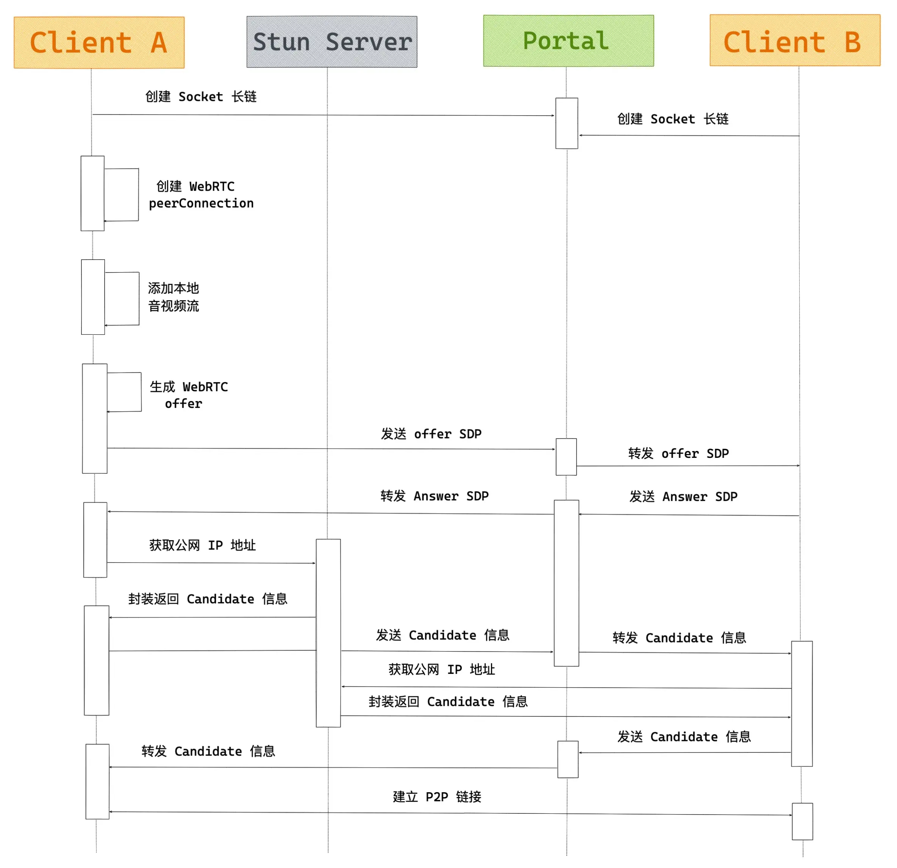
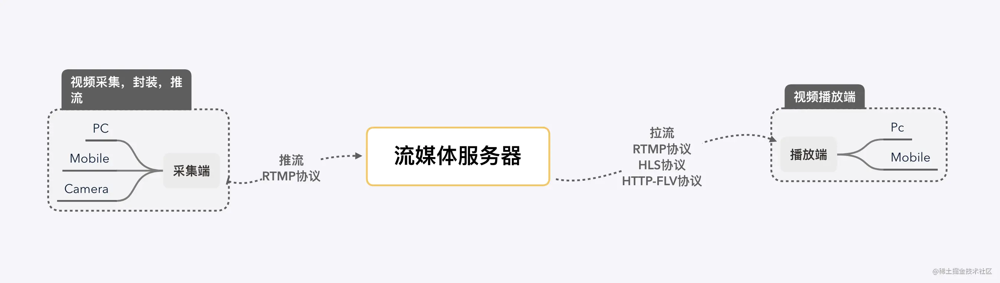

# WebRTC 使用

## WebRTC

-   [WebRTC](https://developer.mozilla.org/en-US/docs/Web/API/WebRTC_API) (Web Real-Time Communications) 是一项实时通讯技术，它允许网络应用或者站点，在不借助中间媒介的情况下，建立浏览器之间点对点（Peer-to-Peer）的连接
-   WebRTC 可以实现视频流和（或）音频流或者其他任意数据的传输。
-   WebRTC 包含的这些标准可以使用户在无需安装任何插件或者第三方的软件的情况下，创建点对点（Peer-to-Peer）的数据分享和电话会议。
-   WebRTC 只能在 HTTPS 协议或者 localhost 下使用，如果是 HTTP 协议，会报错。
-   引入 adpater.js 来适配各浏览器

### 优势

-   跨平台(Web、Windows、MacOS、Linux、iOS、Android)
-   实时传输
-   音视频引擎
-   免费、免插件、免安装
-   主流浏览器支持
-   强大的打洞能力

### 应用场景

-   在线教育
-   音视频会议
-   即时通讯工具
-   直播
-   共享远程桌面
-   P2P 网络加速
-   游戏

### 相关概念

#### 1. SDP

`SDP`：`Session Description Protocol`，它是一种用于描述多媒体会话的协议，它可以帮助我们描述媒体流的信息，比如媒体流的类型，编码格式，分辨率等等。WebRTC 通过`SDP`来交换端与端之间的`网络`和`媒体`信息。

下图中就是一个`SDP`信息的示例：从中你能大概的看到一些你的内网 IP 信息，外网 IP 信息，以及一些媒体流的信息。

```sh
v=0 # SDP版本号
o=- 0 0 IN IP4 120.24.99.xx # 会话标识信息
s=- # 会话名称
t=0 0 # 会话的有效时间
a=group:BUNDLE audio video # 媒体流类型
a=msid-semantic: WMS * # 媒体流标识符
m=audio 9 UDP/TLS/RTP/SAVPF 111 103 104 9 0 8 106 105 13 126 # 音频媒体流
c=IN IP4 120.24.99.xx # 连接信息
a=rtcp:9 IN IP4 0.0.0.0 # RTCP 的 IP 地址
a=candidate:0 1 UDP 2122252543 120.24.99.xx 9 typ host # 候选 IP 地址
# ...等等等
```

#### 2. NAT

`NAT`：`Network Address Translation`，网络地址转换，它可以将私有 IP 地址转换为公共 IP 地址，从而实现私有网络与公共网络之间的通信。
因为 IPv4 的地址空间比较有限，所以我们大多数设备都部署在 `NAT` 网络内部。

#### 3. ICE

`ICE`：`Interactive Connectivity Establishment`，交互式连接建立协议，用于在两个主机之间建立连接，它可以在两个主机之间建立连接，即使它们之间的防火墙阻止了直接连接。

### 相关 API

-   RTCPeerConnection 接口代表一个由本地计算机到远端的 WebRTC 连接。该接口提供了创建、保持、监控、关闭连接的方法的实现。
-   PC.createOffer 创建提议 Offer 方法，此方法会返回 SDP Offer 信息。
-   PC.setLocalDescription 设置本地 SDP 描述信息。
-   PC.setRemoteDescription 设置远端 SDP 描述信息，即对方发过来的 SDP 数据。
-   PC.createAnswer 创建应答 Answer 方法，此方法会返回 SDP Answer 信息。
-   RTCIceCandidate WebRTC 网络信息(IP、端口等)(ICE 能收集本地公网地址，并拿到对方的公网地址后直连)
-   PC.addIceCandidate PC 连接添加对方的 IceCandidate 信息，即添加对方的网络信息。

### WebRTC 建立连接步骤

1. A、B 都连接信令服务器（ws）；
2. A 创建本地视频，并获取会话描述对象（offer sdp）信息；
3. A 将 offer sdp 通过 ws 发送给 B；
4. B 收到信令后，B 创建本地视频，并获取会话描述对象（answer sdp）信息；
5. B 将 answer sdp 通过 ws 发送给 A；
6. A 和 B 开始打洞，收集并通过 ws 交换 ice 信息；
7. 完成打洞后，A 和 B 开始为安全的媒体通信协商秘钥；
8. 至此， A 和 B 可以进行音视频通话。



#### 本地实现

```html
<!DOCTYPE html>
<html lang="en">
    <head>
        <meta charset="UTF-8" />
        <meta name="viewport" content="width=device-width, initial-scale=1.0" />
        <title>Demo</title>
        <style>
            video {
                width: 320px;
            }
        </style>
    </head>
    <body>
        <video id="localVideo" autoplay playsinline></video>
        <video id="remoteVideo" autoplay playsinline></video>

        <div>
            <button id="startBtn">打开本地视频</button>
            <button id="stopBtn">关闭本地视频</button>
            <button id="callBtn">建立连接</button>
            <button id="hangupBtn">断开连接</button>
        </div>
        <!-- 适配各浏览器 API 不统一的脚本 -->
        <script src="https://webrtc.github.io/adapter/adapter-latest.js"></script>
        <script>
            let startBtn = document.getElementById('startBtn')
            let stopBtn = document.getElementById('stopBtn')
            let callBtn = document.getElementById('callBtn')
            let hangupBtn = document.getElementById('hangupBtn')

            startBtn.addEventListener('click', startHandle)
            stopBtn.addEventListener('click', stopHandle)
            callBtn.addEventListener('click', callHandle)
            hangupBtn.addEventListener('click', hangupHandle)

            // 本地流和远端流
            let localStream
            let remoteStream
            let mediaStreamTrack
            // 本地和远端连接对象
            let localPeerConnection
            let remotePeerConnection

            // 本地视频和远端视频
            const localVideo = document.getElementById('localVideo')
            const remoteVideo = document.getElementById('remoteVideo')

            // 设置约束
            const mediaStreamConstraints = {
                video: true,
                audio: true,
            }

            function startHandle() {
                startBtn.disabled = true
                // 1.获取本地音视频流
                // 调用 getUserMedia API 获取音视频流
                navigator.mediaDevices
                    .getUserMedia(mediaStreamConstraints)
                    .then(gotLocalMediaStream)
                    .catch(err => {
                        startBtn.disabled = false
                        console.log('getUserMedia 错误', err)
                    })
            }

            // getUserMedia 获得流后，将音视频流展示并保存到 localStream
            function gotLocalMediaStream(mediaStream) {
                localVideo.srcObject = mediaStream
                localStream = mediaStream
                // console.log(localStream);
                window.stream = mediaStream //用于关闭摄像头
                callBtn.disabled = false
            }
            //   关闭摄像头
            function stopHandle() {
                window.stream.getTracks().forEach(track => track.stop())
                startBtn.disabled = false
            }

            function callHandle() {
                callBtn.disabled = true
                hangupBtn.disabled = false

                // 视频轨道
                const videoTracks = localStream.getVideoTracks()
                // console.log(videoTracks);
                // 音频轨道
                const audioTracks = localStream.getAudioTracks()
                // 判断视频轨道是否有值
                if (videoTracks.length > 0) {
                    console.log(`使用的设备为: ${videoTracks[0].label}.`)
                }
                // 判断音频轨道是否有值
                if (audioTracks.length > 0) {
                    console.log(`使用的设备为: ${audioTracks[0].label}.`)
                }
                const servers = null // 需要一个信令服务器 iceServers字段

                // 创建 RTCPeerConnection 对象
                localPeerConnection = new RTCPeerConnection(servers)
                console.log(localPeerConnection)
                // 监听返回的 Candidate
                localPeerConnection.addEventListener('icecandidate', handleConnection)
                // 监听 ICE 状态变化
                // localPeerConnection.addEventListener('iceconnectionstatechange', handleConnectionChange)

                remotePeerConnection = new RTCPeerConnection(servers)
                remotePeerConnection.addEventListener('icecandidate', handleConnection)
                // remotePeerConnection.addEventListener('iceconnectionstatechange', handleConnectionChange);

                // 接收到远程流
                remotePeerConnection.addEventListener('track', gotRemoteMediaStream)

                // localPeerConnection.addStream(localStream);
                // 遍历本地流的所有轨道
                localStream.getTracks().forEach(track => {
                    console.log(track)
                    localPeerConnection.addTrack(track, localStream)
                })
                console.log(localPeerConnection)

                // 设置仅交换视频
                const offerOptions = {
                    offerToReceiveVideo: 1,
                }
                // 2.交换媒体描述信息
                localPeerConnection
                    .createOffer(offerOptions)
                    .then(createdOffer)
                    .catch(err => {
                        console.log('createdOffer 错误', err)
                    })
            }
            function createdOffer(description) {
                console.log(`本地创建offer返回的sdp:\n${description.sdp}`)
                // 本地设置描述并将它发送给远端
                // 将 offer 保存到本地
                localPeerConnection
                    .setLocalDescription(description)
                    .then(() => {
                        console.log('local 设置本地描述信息成功')
                    })
                    .catch(err => {
                        console.log('local 设置本地描述信息错误', err)
                    })
                // 远端将本地给它的描述设置为远端描述
                // 远端将 offer 保存
                remotePeerConnection
                    .setRemoteDescription(description)
                    .then(() => {
                        console.log('remote 设置远端描述信息成功')
                    })
                    .catch(err => {
                        console.log('remote 设置远端描述信息错误', err)
                    })
                // 远端创建应答 answer
                remotePeerConnection
                    .createAnswer()
                    .then(createdAnswer)
                    .catch(err => {
                        console.log('远端创建应答 answer 错误', err)
                    })
            }

            function createdAnswer(description) {
                console.log(`远端应答Answer的sdp:\n${description.sdp}`)
                // 远端设置本地描述并将它发给本地
                // 远端保存 answer
                remotePeerConnection
                    .setLocalDescription(description)
                    .then(() => {
                        console.log('remote 设置本地描述信息成功')
                    })
                    .catch(err => {
                        console.log('remote 设置本地描述信息错误', err)
                    })
                // 本地将远端的应答描述设置为远端描述
                // 本地保存 answer
                localPeerConnection
                    .setRemoteDescription(description)
                    .then(() => {
                        console.log('local 设置远端描述信息成功')
                    })
                    .catch(err => {
                        console.log('local 设置远端描述信息错误', err)
                    })
            }

            // 3.端与端建立连接
            function handleConnection(event) {
                console.log(event)
                // 获取到触发 icecandidate 事件的 RTCPeerConnection 对象
                // 获取到具体的Candidate
                const peerConnection = event.target
                const iceCandidate = event.candidate

                if (iceCandidate) {
                    // 创建 RTCIceCandidate 对象
                    const newIceCandidate = new RTCIceCandidate(iceCandidate)
                    console.log(newIceCandidate)
                    // 得到对端的 RTCPeerConnection
                    const otherPeer = getOtherPeer(peerConnection)

                    // 将本地获得的 Candidate 添加到远端的 RTCPeerConnection 对象中
                    // 为了简单，这里并没有通过信令服务器来发送 Candidate，直接通过 addIceCandidate 来达到互换 Candidate 信息的目的
                    otherPeer
                        .addIceCandidate(newIceCandidate)
                        .then(() => {
                            handleConnectionSuccess(peerConnection)
                        })
                        .catch(error => {
                            handleConnectionFailure(peerConnection, error)
                        })
                }
            }

            // 4.显示远端媒体流
            function gotRemoteMediaStream(event) {
                if (remoteVideo.srcObject !== event.streams[0]) {
                    remoteVideo.srcObject = event.streams[0]
                    remoteStream = event.streams[0]
                    console.log('remote 开始接受远端流')
                }
            }

            function hangupHandle() {
                // 关闭连接并设置为空
                localPeerConnection.close()
                remotePeerConnection.close()
                localPeerConnection = null
                remotePeerConnection = null
                hangupBtn.disabled = true
                callBtn.disabled = false
            }

            function handleConnectionChange(event) {
                const peerConnection = event.target
                console.log('ICE state change event: ', event)
                console.log(`${getPeerName(peerConnection)} ICE state: ` + `${peerConnection.iceConnectionState}.`)
            }

            function handleConnectionSuccess(peerConnection) {
                console.log(`${getPeerName(peerConnection)} addIceCandidate 成功`)
            }

            function handleConnectionFailure(peerConnection, error) {
                console.log(`${getPeerName(peerConnection)} addIceCandidate 错误:\n` + `${error.toString()}.`)
            }

            function getPeerName(peerConnection) {
                return peerConnection === localPeerConnection ? 'localPeerConnection' : 'remotePeerConnection'
            }

            function getOtherPeer(peerConnection) {
                return peerConnection === localPeerConnection ? remotePeerConnection : localPeerConnection
            }
        </script>
    </body>
</html>
```

#### 使用 p2p 技术

```html
<!DOCTYPE html>
<html lang="en">
    <head>
        <meta charset="UTF-8" />
        <meta http-equiv="X-UA-Compatible" content="IE=edge" />
        <meta name="viewport" content="width=device-width, initial-scale=1.0" />
        <title>p2p</title>
        <script src="https://cdn.jsdelivr.net/npm/vue@2.7.10/dist/vue.js"></script>
        <!-- 引入样式 -->
        <link rel="stylesheet" href="https://unpkg.com/element-ui/lib/theme-chalk/index.css" />
        <!-- 引入组件库 -->
        <script src="https://unpkg.com/element-ui/lib/index.js"></script>
        <style>
            .page-container {
                height: 100%;
                user-select: text;
                display: flex;
                flex-direction: row;
                justify-content: space-around;
                align-items: center;
            }
            .video-container {
                max-width: 500px;
                display: grid;
                grid-template-rows: 1fr 1fr;
                grid-template-columns: 1fr;
                gap: 1em;
                width: 100%;
                padding: 10px;
            }

            video {
                width: 100%;
                height: 100%;
                border: 4px solid #048ff2;
                background-color: #516fa3;
                border-radius: 30px;
            }
            .operation {
                width: 520px;
            }

            .step {
                padding: 30px;
                background-color: #516fa3;
                margin: 10px 0;
                color: white;
                border-radius: 20px;
            }
        </style>
    </head>
    <body>
        <div id="app">
            <div class="page-container">
                <div class="video-container">
                    <video id="local" autoplay playsinline muted></video>
                    <video id="remote" autoplay playsinline></video>
                </div>
                <div class="operation">
                    <div class="step">
                        <p>用户 1，点击 Create Offer，生成 SDP offer，把下面生成的offer 复制给用户 2</p>
                        <el-button id="create-offer" type="primary" size="default" @click="createOffer()">
                            创建 Offer
                        </el-button>
                        <p>SDP offer:</p>
                        <el-input v-model="offerSdp" placeholder="User 2, paste SDP offer here...">
                            <template #append>
                                <el-button type="success" size="default" @click="copyToClipboard(offerSdp)">
                                    点击复制
                                </el-button>
                            </template>
                        </el-input>
                    </div>

                    <div class="step">
                        <p>
                            用户 2将用户1 刚才生成的SDP offer 粘贴到下方，点击 "创建答案 "来生成SDP答案，然后将 SDP
                            Answer 复制给用户 1。
                        </p>

                        <el-input v-model="offerSdp" placeholder="User 2, paste SDP offer here...">
                            <template #append>
                                <el-button type="success" size="default" @click="createAnswer()">创建 Answer</el-button>
                            </template>
                        </el-input>

                        <p>SDP Answer:</p>
                        <el-input v-model="answerSdp" placeholder="生成的SDP answer">
                            <template #append>
                                <el-button type="success" size="default" @click="copyToClipboard(answerSdp)">
                                    点击复制
                                </el-button>
                            </template>
                        </el-input>
                    </div>

                    <p>SDP Answer:</p>
                    <el-input v-model="answerSdp" placeholder="User 1, paste SDP answer here...">
                        <template #prepend>
                            <el-button type="success" size="default" @click="copyToClipboard(answerSdp)">
                                点击复制
                            </el-button>
                        </template>
                        <template #append>
                            <el-button type="success" size="default" @click="addAnswer()">Add Answer</el-button>
                        </template>
                    </el-input>

                    <div class="step">
                        <b>3.</b>
                        创建者，将 加入者 产生的SDP offer 粘贴到上面的文本区域，然后点击 Add Answer。
                    </div>
                </div>
            </div>
        </div>
        <script>
            // http-server -p 3000 -S
            new Vue({
                el: '#app',
                data() {
                    return {
                        peerConnection: null,
                        localStream: null,
                        remoteStream: null,

                        offerSdp: '',
                        answerSdp: '',
                    }
                },
                mounted() {
                    this.peerConnection = new RTCPeerConnection({
                        iceServers: [
                            // { urls: 'stun:stun.l.google.com:19302' },
                            // { urls: 'stun:stun1.l.google.com:19302' },
                            // { urls: 'stun:stun2.l.google.com:19302' },
                            // { urls: 'stun:stun3.l.google.com:19302' },
                            // { urls: 'stun:stun4.l.google.com:19302' },
                            // { urls: 'stun:stun.ideasip.com' },
                            // { urls: 'stun:stun.schlund.de' },
                            // { urls: 'stun:stun.stunprotocol.org' },
                            { urls: 'stun:stun.voipbuster.com ' }, //公共服务器
                        ],
                    })
                    this.init()
                },
                methods: {
                    async init() {
                        // 获取本地端视频标签
                        const localVideo = document.getElementById('local')
                        // 获取远程端视频标签
                        const remoteVideo = document.getElementById('remote')
                        // 获取本地媒体流
                        this.localStream = await navigator.mediaDevices.getUserMedia({
                            video: true,
                            audio: false,
                        })
                        // 创建远程空媒体流
                        this.remoteStream = new MediaStream()
                        // 设置本地视频流
                        localVideo.srcObject = this.localStream
                        // 设置远程视频流
                        remoteVideo.srcObject = this.remoteStream
                        // 添加本地流到 peerConnection
                        this.localStream.getTracks().forEach(track => {
                            this.peerConnection.addTrack(track, this.localStream)
                        })
                        // 监听远程流
                        this.peerConnection.ontrack = event => {
                            event.streams[0].getTracks().forEach(track => {
                                this.remoteStream.addTrack(track)
                            })
                        }
                    },
                    // 创建 offer
                    async createOffer() {
                        // 收集本地可用的公网地址，收到后通过信令服务器发送给对方
                        this.peerConnection.onicecandidate = async event => {
                            if (event.candidate) {
                                console.log('onicecandidate-offer')
                                this.offerSdp = JSON.stringify(this.peerConnection.localDescription)
                            }
                        }
                        const offer = await this.peerConnection.createOffer()
                        await this.peerConnection.setLocalDescription(offer)
                        console.log('createOffer')
                    },
                    // 创建 answer
                    async createAnswer() {
                        const offer = JSON.parse(this.offerSdp)
                        this.peerConnection.onicecandidate = async event => {
                            if (event.candidate) {
                                console.log('onicecandidate-answer')
                                this.answerSdp = JSON.stringify(this.peerConnection.localDescription)
                            }
                        }
                        await this.peerConnection.setRemoteDescription(offer)
                        const answer = await this.peerConnection.createAnswer()
                        await this.peerConnection.setLocalDescription(answer)
                        console.log('createOffer')
                    },

                    // 添加 answer
                    async addAnswer() {
                        const answer = JSON.parse(this.answerSdp)
                        if (!this.peerConnection.currentRemoteDescription) {
                            console.log('addAnswer')
                            this.peerConnection.setRemoteDescription(answer)
                        }
                    },

                    copyToClipboard(val) {
                        navigator.clipboard.writeText(val)
                    },
                },
            })
        </script>
    </body>
</html>
```

### 缺陷

-   兼容性问题。在 Web 端存在浏览器之间的兼容性问题，虽然 WebRTC 组织在 GitHub 上提供了 WebRTC 适配器，但除此之外仍要面临浏览器行为不一致的问题
-   传输质量不稳定。由于 WebRTC 使用的是对点对传输，跨运营商、跨地区、低带宽、高丢包等场景下的传输质量基本听天由命。
-   移动端适配差。针对不同机型需要做适配，很难有统一的用户体验。

## 相关文章

-   [前端音视频 WebRTC 实时通讯的核心](https://juejin.cn/post/6884851075887661070)
-   [WebRTC：会话描述协议 SDP](https://zhuanlan.zhihu.com/p/75492311)
-   [WebRTC 从实战到未来！迎接风口，前端必学的技术](https://juejin.cn/post/7151932832041058340#comment)
-   [信令与视频通话](https://developer.mozilla.org/zh-CN/docs/Web/API/WebRTC_API/Signaling_and_video_calling)
-   [音视频通话实战与原理](https://github.com/wangrongding/frontend-park/blob/main/src/page/webRTC/wertc-connect.md)

## 直播通信技术

#### 概念

-   采集端：顾名思义是视频的源头，视频的采集一般都是从真实的摄像头中得到的。例如移动端设别、PC 端设备的摄像头以及一些摄像头设备；
-   流媒体服务器：流媒体服务器是整个直播技术框架的非常重要的一环，它需要接收从采集端推上来的视频流，然后将该视频流再推送到播放端；
-   播放端：播放端就是各种 app，网页中的播放器，拉取流媒体服务器上的视频流，然后进行转码，最终播放出来；
-   推流:把采集阶段收集的数据封装好传输到服务器的过程；
-   拉流:服务器已有直播内容,用指定地址进行拉取的过程。

-   RTMP (可用于推流端和拉流端)Real Time Messaging Protocol，实时消息传输协议。RTMP 协议中，视频必须是 H264 编码，音频必须是 AAC 或 MP3 编码，且多以 flv 格式封包。因为 RTMP 协议传输的基本是 FLV 格式的流文件，必须使用 flash 播放器才能播放。

-   RTSP (用于推流端)Real-Time Stream Protocol，RTSP 实时效果非常好，适合视频聊天、视频监控等方向。

-   HLS (用于拉流端)Http Live Streaming，由 Apple 公司定义的基于 HTTP 的流媒体实时传输协议。传输内容包括两部分：1.M3U8 描述文件；2.TS 媒体文件。TS 媒体文件中的视频必须是 H264 编码，音频必须是 AAC 或 MP3 编码。数据通过 HTTP 协议传输。目前 video.js 库支持该格式文件的播放。

-   HTTP-FLV (用于拉流端)本协议就是 http+flv，将音视频数据封装成 FLV 格式，然后通过 http 协议传输到客户端，这个协议大大方便了浏览器客户端播放直播视频流。目前 flv.js 库支持该格式的文件播放。


