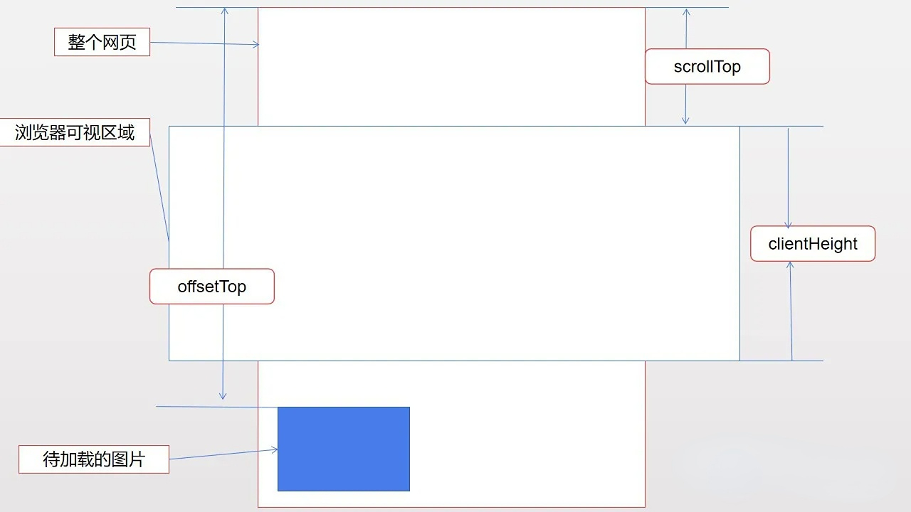

# 懒加载

## 图片懒加载

### 方式 1 image 标签中添加一个 loading=“lazy”

``
缺点：无法设置默认的加载图片、加载失败的图片

### 方式 2 监听滚动事件

-   屏幕可视区域的高度: `window.innerHeight || document.documentElement.clientHeight`
-   元素相对于文档顶部的高度: `element.getBoundingClientRect().top || element.offsetTop`
-   滚动条滚动的距离: `documentElement.scrollTop`
    

```js
window.onload = window.onscroll = function () {
    //onscroll()在滚动条滚动的时候触发
    loadImg()
}
function loadImg() {
    if (documentElement.scrollTop + document.documentElement.clientHeight > element.offsetTop) {
        element.src = element.dataset.src
    }
}
```

缺点：事件监听和调用 `Element.getBoundingClientRect()` 都是在主线程上运行，因此频繁触发、调用可能会造成性能问题

### 方式 3 基于 intersectionObserver

-   `intersectionObserver` 可以直接判断图片是否在可视区域内
-   异步检测目标元素与祖先元素或 viewport 相交情况变化

```js
const intersectionObserver = new IntersectionObserver(callback, option)
function callback (entries){
    entries.forEach(item => {
      if (item.isIntersecting) {
        item.target.src = item.target.dataset.origin; // 开始加载图片,把data-origin的值放到src
        observer.unobserve(item.target); // 停止监听已开始加载的图片
      }
    });
}
option={
    root //所监听对象的具体祖先元素。如果未传入值或值为null，则默认使用顶级文档的视窗。
    rootMargin  //预先加载的距离
    threshold // 特定的相交比例
}

imagesDom.forEach(item => observer.observe(item)); // 每个dom添加监听
```

## 虚拟滚动

### [定高的虚拟滚动](%E5%AE%9A%E9%AB%98%E8%99%9A%E6%8B%9F%E5%88%97%E8%A1%A8.html)

-   可以使用 IntersectionObserver 替代监听 scroll 事件

### 不定高

[虚拟滚动](https://juejin.cn/post/6844903982742110216)

## css 新属性

### content-visibility

-   可以控制一个元素是否渲染其内容，并且允许浏览器跳过这些元素的布局与渲染。
    -   visible：默认值，没有效果。元素的内容被正常布局和呈现。
    -   hidden：元素跳过它的内容。跳过的内容不能被用户代理功能访问，例如在页面中查找、标签顺序导航等，也不能被选择或聚焦。这类似于给内容设置 display: none。
    -   auto：该元素打开布局包含、样式包含和绘制包含。如果该元素与用户不相关，它也会跳过其内容。与 hidden 不同，跳过的内容必须仍可正常用于用户代理功能，例如在页面中查找、tab 顺序导航等，并且必须正常可聚焦和可选择。

### contain-intrinsic-size

-   指定的元素自然大小，确保我们未渲染子元素的 div 仍然占据空间，同时也保留延迟渲染的好处。
-   我们只需要给添加了 content-visibility: auto 的元素添加上 contain-intrinsic-size 就能够解决滚动条抖动的问题，当然，这个高度约接近真实渲染的高度，效果会越好，如果实在无法知道准确的高度，我们也可以给一个大概的值，也会使滚动条的问题相对减少。

```css
.card_item {
    content-visibility: auto;
    contain-intrinsic-size: 200px;
}
```
