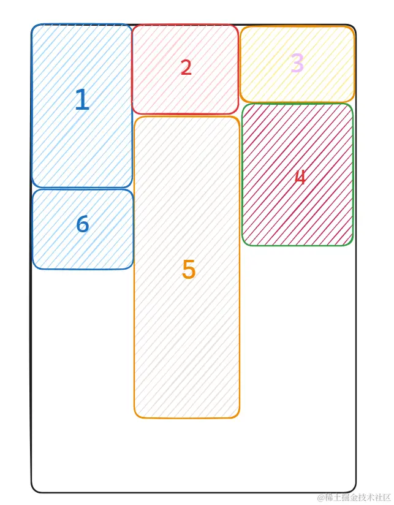
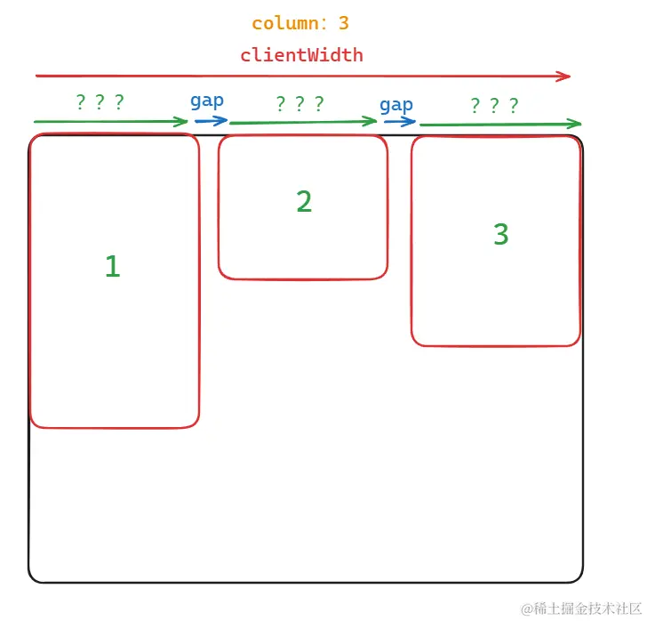

# 瀑布流

## 布局和实现逻辑



-   首选确定列数, 列数和屏幕宽度有关
-   维护一个数组（长度为列数），第一行依次排列（各列放入数组中），第二列选择第一行中高度最小的列，并将第二行的高度加入对应列，以此类推

```html
<template>
    <div class="fs-waterfall-container" ref="containerRef">
        <div class="fs-waterfall-list">
            <div
                class="fs-waterfall-item"
                v-for="(item, index) in state.cardList"
                :key="item.id"
                :style="{
          width: `${state.cardPos[index].width}px`,
          height: `${state.cardPos[index].height}px`,
          transform: `translate3d(${state.cardPos[index].x}px, ${state.cardPos[index].y}px, 0)`,
        }"
            >
                <slot name="item" :item="item" :index="index"></slot>
            </div>
        </div>
    </div>
</template>
```

```scss
.fs-waterfall {
    &-container {
        width: 100%;
        height: 100%;
        overflow-y: scroll; // 注意需要提前设置展示滚动条，如果等数据展示再出现滚动造成计算偏差
        overflow-x: hidden;
    }

    &-list {
        width: 100%;
        position: relative;
    }
    &-item {
        position: absolute;
        left: 0;
        top: 0;
        box-sizing: border-box;
    }
}
```

-   container 需要滚动，list 需要相对定位，item 需要绝对定位
-   确定瀑布流的常量
    -   列数（column）
    -   列间距（gap）
    -   距底距离（bottom）

## 图片的宽高

-   项目中使用会由后端和图片地址一同返回
-   前端计算（预加载），需要加载所有图片后才能渲染图片
    ```js
    function preLoadImage(link) {
        return new Promise((resolve, reject) => {
            const img = new Image()
            img.src = link
            img.onload = () => {
                // load 事件代表图片已经加载完毕，通过该回调才访问到图片真正的尺寸信息
                resolve({ width: img.width, height: img.height })
            }
            img.onerror = err => {
                reject(err)
            }
        })
    }
    ```

## 卡片的宽度

-   卡片的宽度和浏览器宽度相关
    

    ````js
    const containerWidth = containerRef.value.clientWidth;
    state.cardWidth = (containerWidth - props.gap \* (props.column - 1)) / props.column;

        ```
    ````

## 计算最小列高度和卡片位置

```js
const minColumn = computed(() => {
    let minIndex = -1,
        minHeight = Infinity

    state.columnHeight.forEach((item, index) => {
        //columnHeight为维护的列高数组
        if (item < minHeight) {
            minHeight = item
            minIndex = index
        }
    })

    return {
        minIndex,
        minHeight,
    }
})
```

1. 遍历数据项，计算当前数据项缩放后的卡片高度（根据后端返回的宽高信息以及 state.cardWidth 计算）
2. 区分第一行和其余行布局
3. 第一行卡片位置信息紧挨排布，高度更新至对应列的 state.columnHeight 中
4. 其余行需要先获得最小高度列信息再计算其卡片位置，最终将高度累加到对应列的 state.columnHeight 中

```js
// 计算卡片位置
const computedCardPos = (list: ICardItem[]) => {
    //为图片数组
    list.forEach((item, index) => {
        const cardHeight = Math.floor((item.height * state.cardWidth) / item.width)
        if (index < props.column) {
            state.cardPos.push({
                width: state.cardWidth,
                height: cardHeight,
                x: index % props.column !== 0 ? index * (state.cardWidth + props.gap) : 0,
                y: 0,
            })
            state.columnHeight[index] = cardHeight + props.gap
        } else {
            const { minIndex, minHeight } = minColumn.value
            state.cardPos.push({
                width: state.cardWidth,
                height: cardHeight,
                x: minIndex % props.column !== 0 ? minIndex * (state.cardWidth + props.gap) : 0,
                y: minHeight,
            })
            state.columnHeight[minIndex] += cardHeight + props.gap
        }
    })
}
```
